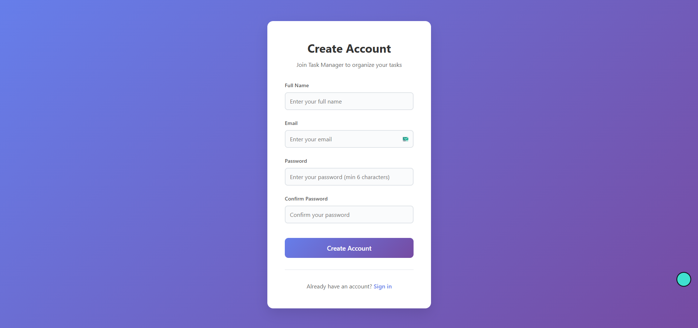
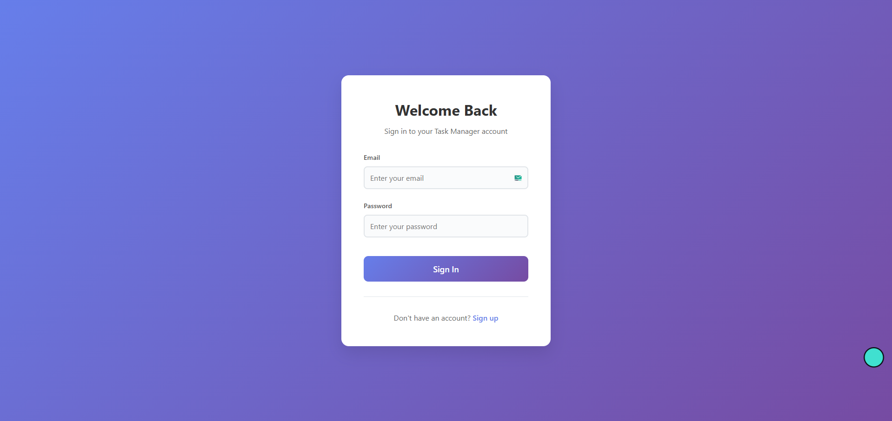
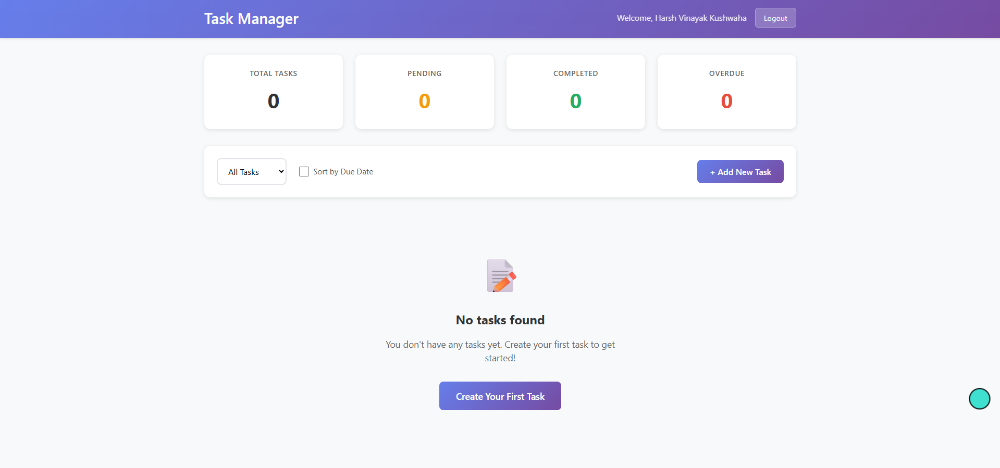
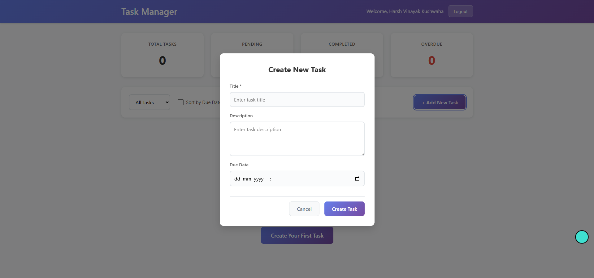
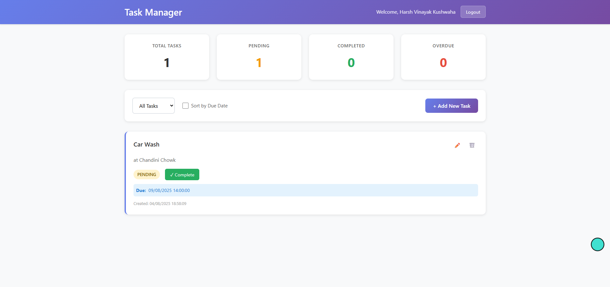
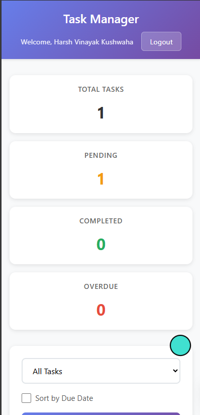

# Task Manager App

A full-stack task management application built with React and Node.js + Express.js. This application allows users to register, login, and manage their personal tasks with features like creating, editing, deleting, and marking tasks as complete.

## 🚀 Features

### Core Features
- **User Authentication**: Secure registration and login with JWT tokens
- **Task CRUD Operations**: Create, read, update, and delete tasks
- **Task Status Management**: Mark tasks as pending or completed
- **Task Filtering**: Filter tasks by status (All, Pending, Completed)
- **Task Properties**: Title, description, status, created_at, updated_at

### Bonus Features ✨
- **Due Date Support**: Set and track task due dates
- **Sort by Due Date**: Organize tasks by urgency
- **Responsive Design**: Mobile-friendly interface
- **Real-time Statistics**: View task counts and completion status
- **Modern UI/UX**: Clean, intuitive design with smooth animations

## 🛠️ Tech Stack

### Frontend
- **React 18** - Modern UI library with hooks
- **React Router DOM** - Client-side routing
- **Axios** - HTTP client for API calls
- **CSS3** - Custom styling with flexbox and grid

### Backend
- **Node.js 18** - JavaScript runtime
- **Express.js** - Web application framework
- **JWT (JSON Web Tokens)** - Secure authentication
- **bcryptjs** - Password hashing
- **SQLite3** - Embedded database
- **CORS** - Cross-origin resource sharing

### Database
- **SQLite** - Embedded relational database

## 📁 Project Structure

```
task-manager-app/
├── backend-node/               # Node.js/Express Backend
│   ├── config/                # Configuration files
│   │   └── database.js        # Database setup
│   ├── controllers/           # Request handlers
│   │   ├── authController.js  # Authentication logic
│   │   └── taskController.js  # Task management logic
│   ├── middleware/            # Custom middleware
│   │   └── auth.js           # JWT authentication
│   ├── models/               # Data models
│   │   ├── User.js           # User model
│   │   └── Task.js           # Task model
│   ├── routes/               # API routes
│   │   ├── auth.js           # Authentication routes
│   │   └── tasks.js          # Task routes
│   ├── server.js             # Main server file
│   ├── package.json          # Dependencies
│   └── taskmanager.db        # SQLite database
├── frontend/                  # React Frontend
│   ├── public/
│   ├── src/
│   │   ├── components/       # Reusable React components
│   │   ├── pages/           # Page components
│   │   ├── services/        # API calls and context
│   │   └── App.js
│   └── package.json
└── README.md
```

## 🚦 Getting Started

### Prerequisites
- **Node.js 16** or higher

### Backend Setup (Node.js/Express)

1. Navigate to the backend directory:
```bash
cd backend-node
```

2. Install dependencies:
```bash
npm install
```

3. Start the backend server:
```bash
npm start
```

The backend will start on `http://localhost:8080`

### Frontend Setup

1. Navigate to the frontend directory:
```bash
cd frontend
```

2. Install dependencies:
```bash
npm install
```

3. Start the development server:
```bash
npm start
```

The frontend will start on `http://localhost:3000`

## 🔗 API Endpoints

### Authentication
- `POST /api/auth/signup` - Register a new user
- `POST /api/auth/signin` - Login user

### Tasks
- `GET /api/tasks` - Get all tasks for authenticated user
- `GET /api/tasks?status=PENDING` - Get tasks by status
- `GET /api/tasks?sortByDueDate=true` - Get tasks sorted by due date
- `POST /api/tasks` - Create a new task
- `PUT /api/tasks/{id}` - Update a task
- `PUT /api/tasks/{id}/complete` - Mark task as completed
- `DELETE /api/tasks/{id}` - Delete a task

## 🧪 Testing

### Backend Testing
```bash
cd backend
npm test
```

### Frontend Testing
```bash
cd frontend
npm test
```

## 🎯 Usage Guide

### 1. Registration
1. Visit `http://localhost:3000`
2. Click "Sign up" if you don't have an account
3. Fill in your name, email, and password
4. Click "Create Account"

### 2. Login
1. Enter your email and password
2. Click "Sign In"
3. You'll be redirected to the dashboard

### 3. Managing Tasks
1. **Create Task**: Click "Add New Task" button
2. **Edit Task**: Click the edit icon (✏️) on any task
3. **Complete Task**: Click "✓ Complete" button on pending tasks
4. **Delete Task**: Click the delete icon (🗑️) on any task
5. **Filter Tasks**: Use the dropdown to filter by status
6. **Sort Tasks**: Check "Sort by Due Date" to organize by urgency

## 🎨 Design Approach

### Frontend Architecture
- **Component-based Architecture**: Modular, reusable components
- **Context API**: Global state management for authentication
- **Protected Routes**: Secure route access based on authentication
- **Responsive Design**: Mobile-first approach with CSS Grid and Flexbox
- **Error Handling**: User-friendly error messages and loading states

### Backend Architecture
- **Layered Architecture**: Clear separation of concerns
- **RESTful API Design**: Standard HTTP methods and status codes
- **JWT Authentication**: Stateless authentication mechanism
- **Input Validation**: Server-side validation for data integrity
- **Exception Handling**: Comprehensive error handling

### Security Features
- **Password Encryption**: BCrypt hashing
- **JWT Tokens**: Secure token-based authentication
- **CORS Configuration**: Controlled cross-origin requests
- **Authorization**: Role-based access control

## 🚧 Challenges Faced & Solutions

### 1. CORS Issues
**Challenge**: Cross-origin requests between React (port 3000) and Node.js (port 8080)
**Solution**: Configured CORS in Express server with proper allowed origins and methods

### 2. JWT Token Management
**Challenge**: Handling token expiration and automatic logout
**Solution**: Implemented axios interceptors for automatic token attachment and logout on 401 errors

### 3. State Management
**Challenge**: Managing user authentication state across components
**Solution**: Used React Context API for global authentication state

### 4. Responsive Design
**Challenge**: Creating a mobile-friendly interface
**Solution**: Implemented CSS Grid and Flexbox with mobile-first approach

## 🔮 Future Enhancements

- **Drag & Drop**: Trello-style task management
- **Task Categories**: Organize tasks by categories
- **Team Collaboration**: Share tasks with other users
- **Push Notifications**: Reminders for due tasks
- **Advanced Filtering**: Search, date ranges, priority levels
- **Dark Mode**: Theme switching capability
- **File Attachments**: Add files to tasks
- **Task Comments**: Collaborative notes on tasks

## 📸 Screenshots

### Signup Page

*User registration interface with form validation and clean design*

### Login Page

*Clean, modern login interface with form validation*

### Dashboard

*Comprehensive dashboard with task statistics, filtering, and responsive grid layout*

### Task Creation

*Modal-based task creation with due date support*

### Task Management

*Task list with CRUD operations, status management, and filtering options*

### Mobile View

*Fully responsive design that works seamlessly on mobile devices*

## 🤝 Contributing

1. Fork the repository
2. Create a feature branch (`git checkout -b feature/amazing-feature`)
3. Commit your changes (`git commit -m 'Add some amazing feature'`)
4. Push to the branch (`git push origin feature/amazing-feature`)
5. Open a Pull Request
